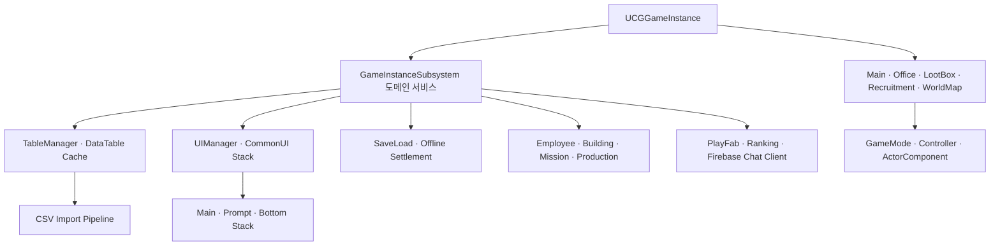

# 회사키우기 : 방치형 도시 타이쿤

> Unreal Engine 5.4 C++ client architecture portfolio · 개인 개발 · 2025.11 – 진행 중

Epic Games의 Cropout Sample Project가 보여주는 Blueprint 기반 크로스 플랫폼 구조를 학습 기준선으로 삼고, 회사 성장·도시 운영 도메인에 맞는 C++ 클라이언트 구조로 재설계한 개인 프로젝트입니다. 기본 아키텍처, 시스템 경계, 데이터 흐름과 최종 기술 판단은 직접 설계했습니다.

> **Source-only portfolio snapshot.** Licensed assets, levels, WBP/DataTable assets, production configuration, and third-party plugin binaries are intentionally excluded. This repository is not a standalone runnable game build.

## 공개 범위

- 기준 스냅샷: `7df820f2` · 2026-08-25
- 프로젝트 `Source` 전체: 878개 추적 파일
- C++ Automation Test 소스: 62개 파일 · 148개 테스트 선언
- 선별한 DataTable CSV, 제작·검증 도구, 기술 문서
- 정제한 `AGENTS.md`, `CLAUDE.md`, 역할별 Agent·Skill·Hook
- 제외: `Content`, 외부 에셋, 실제 Config, 인증정보, Firebase 서버 구현, Azure 히스토리

테스트 수는 선언·소스 기준이며 전체 통과를 과장하지 않습니다. 공개 저장소에서 독립 실행 가능한 도구 테스트는 아래 결과만 표기하고, 정적 공개 안전성 검사는 별도로 수행했습니다.

## 전체 구조



레벨 전환 뒤에도 유지돼야 하는 도메인 상태는 `GameInstanceSubsystem`에 두고, 월드에 종속되는 입력·표현·배치는 GameMode, Controller, ActorComponent로 분리했습니다. 자세한 설명은 [아키텍처 개요](docs/ARCHITECTURE.md)에서 볼 수 있습니다.

## Code Tour

### 1. Subsystem 중심 아키텍처

| 파일 | 확인할 내용 |
|---|---|
| [CGGameInstance.cpp](Source/CompanyGrowthRenewal/Private/Core/CGGameInstance.cpp) | 레벨 전환과 GameInstance 수명주기의 진입점 |
| [SoundManagerSubsystem.h](Source/CompanyGrowthRenewal/Public/Manager/SoundManagerSubsystem.h) / [cpp](Source/CompanyGrowthRenewal/Private/Manager/SoundManagerSubsystem.cpp) | 전역 서비스의 초기화·공개 API 경계 |
| [BuildingTraitManagerSubsystem.h](Source/CompanyGrowthRenewal/Public/Manager/BuildingTraitManagerSubsystem.h) / [cpp](Source/CompanyGrowthRenewal/Private/Manager/BuildingTraitManagerSubsystem.cpp) | 독립 도메인 규칙과 저장 상태의 분리 |

### 2. DataTable 콘텐츠 파이프라인

| 파일 | 확인할 내용 |
|---|---|
| [TableManagerSubsystem.h](Source/CompanyGrowthRenewal/Private/Manager/TableManagerSubsystem.h) / [cpp](Source/CompanyGrowthRenewal/Private/Manager/TableManagerSubsystem.cpp) | 생성자 로드 → 초기화 캐시 → 타입별 Getter 경로 |
| [WidgetDataTable.h](Source/CompanyGrowthRenewal/Public/Table/WidgetDataTable.h) | `FTableRowBase` 기반 위젯 클래스 매핑 |
| [DT_WidgetClass 샘플](DataImport/Samples/DT_WidgetClass_Import.csv) | `EWidgetType`과 WBP 클래스의 데이터 주도 연결 |
| [DT_StepDisplayName 샘플](DataImport/Samples/DT_StepDisplayName_Import.csv) | 표시 문자열을 코드 분기에서 분리한 예시 |

Row가 없을 때 코드 폴백으로 오류를 숨기지 않고 빈 결과와 경고로 드러내며, 콘텐츠 수정은 CSV 편집과 Reimport로 끝나도록 구성했습니다.

### 3. CommonUI Stack 라우팅

| 파일 | 확인할 내용 |
|---|---|
| [UIBase.h](Source/CompanyGrowthRenewal/Public/UI/UIBase.h) / [cpp](Source/CompanyGrowthRenewal/Private/UI/UIBase.cpp) | Main·Prompt·Bottom Stack의 역할 분리 |
| [UIManagerSubsystem.cpp](Source/CompanyGrowthRenewal/Private/Manager/UIManagerSubsystem.cpp) | 위젯 타입 조회와 Stack Push 중앙화 |
| [AnimatedActivatableWidget.h](Source/CompanyGrowthRenewal/Public/UI/AnimatedActivatableWidget.h) / [cpp](Source/CompanyGrowthRenewal/Private/UI/AnimatedActivatableWidget.cpp) | CommonActivatableWidget 수명주기와 전환 연출 |

화면을 여는 코드가 특정 WBP 경로를 직접 알지 않게 하고, `EWidgetType → DT_WidgetClass → TableManager → CommonUI Stack` 경로로 통일했습니다.

### 4. 저장·오프라인 정산

| 파일 | 확인할 내용 |
|---|---|
| [SaveLoadManager.h](Source/CompanyGrowthRenewal/Public/Manager/SaveLoadManager.h) / [cpp](Source/CompanyGrowthRenewal/Private/Manager/SaveLoadManager.cpp) | 로드 완료 가드, 지연 저장, 저장·로드 대칭성 |
| [GameSaveData.h](Source/CompanyGrowthRenewal/Public/Data/GameSaveData.h) | 도메인별 SaveData 집계 구조 |
| [OfflineReportModalWidget.cpp](Source/CompanyGrowthRenewal/Private/UI/Panel/OfflineReportModalWidget.cpp) | 오프라인 정산 결과의 UI 전달 |
| [OfficeExteriorSaveRoundTripTests.cpp](Source/CompanyGrowthRenewal/Private/Tests/OfficeExteriorSaveRoundTripTests.cpp) | 저장 후 복원 불변식 검증 사례 |

클릭·홀드 같은 고빈도 변경은 즉시 디스크에 쓰지 않고 지연 저장하며, 최초 로드가 끝나기 전 빈 메모리가 기존 세이브를 덮지 못하게 막았습니다.

### 5. PC·모바일 입력과 카메라

| 파일 | 확인할 내용 |
|---|---|
| [PlayerCamera.h](Source/CompanyGrowthRenewal/Private/Player/PlayerCamera.h) / [cpp](Source/CompanyGrowthRenewal/Private/Player/PlayerCamera.cpp) | 이동·줌·회전·포커싱 API |
| [MovementInputHandler.cpp](Source/CompanyGrowthRenewal/Private/Player/Components/MovementInputHandler.cpp) | PC 가속 이동과 모바일 드래그 입력 분리 |
| [InputTypeManager.cpp](Source/CompanyGrowthRenewal/Private/Player/InputTypeManager.cpp) | KeyMouse·Touch·GamePad 모드 전환 |
| [MainMapPlayerController.cpp](Source/CompanyGrowthRenewal/Private/Player/MainMapPlayerController.cpp) | 월드 인터랙션과 UI 입력 모드 경계 |

PC와 모바일을 동일한 입력 함수에 억지로 맞추지 않고 체감과 상태 전이를 플랫폼별 경로로 나눴습니다.

### 6. PlayFab·Firebase 연동 구조

| 파일 | 확인할 내용 |
|---|---|
| [PlayFabManagerSubsystem.h](Source/CompanyGrowthRenewal/Public/Manager/PlayFabManagerSubsystem.h) / [cpp](Source/CompanyGrowthRenewal/Private/Manager/PlayFabManagerSubsystem.cpp) | 인증·플레이어 데이터·서버시간 API 경계 |
| [RankingManagerSubsystem.cpp](Source/CompanyGrowthRenewal/Private/Manager/RankingManagerSubsystem.cpp) | 랭킹 요청과 화면 데이터 분리 |
| [ChatManagerSubsystem.h](Source/CompanyGrowthRenewal/Public/Manager/ChatManagerSubsystem.h) / [cpp](Source/CompanyGrowthRenewal/Private/Manager/ChatManagerSubsystem.cpp) | Firebase HTTP/JSON 채팅 클라이언트와 폴링 수명주기 |
| [BACKEND_ARCHITECTURE.md](docs/01_Systems/Backend/BACKEND_ARCHITECTURE.md) | 클라이언트·서버 계약과 권위 경계 |

실제 배포 주소와 서버 구현은 공개본에서 제외했습니다. 클라이언트가 서버 계약을 소비하는 구조와 오류 처리만 확인할 수 있습니다.

### 7. Automation Test와 제작·검증 도구

| 파일 | 확인할 내용 |
|---|---|
| [TutorialMissionAtomicCommitRulesTests.cpp](Source/CompanyGrowthRenewal/Private/Tests/TutorialMissionAtomicCommitRulesTests.cpp) | 다단계 상태 변경의 원자성 규칙 |
| [OfficeExteriorSaveRoundTripTests.cpp](Source/CompanyGrowthRenewal/Private/Tests/OfficeExteriorSaveRoundTripTests.cpp) | 직렬화 Round Trip 검증 |
| [Balance assertions.js](Tools/Balance/verify/assertions.js) | 데이터 기반 밸런스 검증 규칙 |
| [Night readability validator](Tools/MainMapPreview/validate_night_readability_ab.py) | 동일 조건 캡처의 정량 비교 |
| [Cheat command doc guard](Tools/CheatDoc/verify_cheat_docs.py) | C++ Exec 선언과 문서의 자동 동기화 |

공개본에서 외부 에셋 없이 독립 실행 가능한 검증은 다음 결과를 확인했습니다.

| 검증 | 결과 |
|---|---|
| Node Balance 시뮬레이터 | 135개 중 129개 통과 · 6개 조건부 스킵 · 실패 0 |
| Python 렌더링 계약 | 110개 통과 · 실패 0 |
| Cheat 문서 동기화 | C++ `Exec` 명령 85개와 Markdown·HTML 문서 일치 |

C++ Automation Test는 테스트 소스와 선언을 공개하지만, 맵·WBP·DataTable·외부 플러그인이 제외된 이 저장소에서 전체 실행 통과를 주장하지 않습니다.

### 8. 대표 트러블슈팅

- [모바일 Flickering·Shimmer 진단](docs/07_Reference/TROUBLESHOOTING_FLICKERING.md)
- [Android 렌더링 측정과 A/B 기준](docs/08_Optimization/MOBILE_RENDERING.md)
- [성능 최적화 플레이북](docs/08_Optimization/PERFORMANCE_OPTIMIZATION.md)
- [카메라·입력 상태 전이](docs/01_Systems/Player/CAMERA_MOVEMENT_SYSTEM.md)
- [백엔드 연동 함정과 검증](docs/01_Systems/Backend/BACKEND_PLAYBOOK.md)
- [포트폴리오용 문제 해결 요약](docs/TROUBLESHOOTING.md)

## AI 활용 방식

기본 구조와 최종 판단은 개발자가 소유하고, AI는 탐색 범위 확장·구현 초안·독립 리뷰·반복 검증을 가속하는 도구로 사용했습니다.

```text
현상 수집
→ 기존 구조·의존성 탐색
→ 복수 가설 생성
→ 최소 재현과 측정
→ 가설 기각·채택
→ 구현과 독립 리뷰
→ UBT·Automation Test·PIE·Android 실기기 검증
→ Skill·Hook·문서로 재발 방지
```

- [AI 협업 워크플로](docs/AI_WORKFLOW.md)
- [Codex 프로젝트 규칙](AGENTS.md)
- [Claude Code 프로젝트 규칙](CLAUDE.md)
- [프로젝트 Skill](.agents/skills/)
- [역할별 Claude Agent](.claude/agents/)
- [자동 가드 Hook](.claude/hooks/)

## 기술 문서

- [레벨·수명주기 아키텍처](docs/00_Core/ARCHITECTURE.md)
- [UI 생성 플레이북](docs/05_UI/UI_CREATION_PLAYBOOK.md)
- [UI 스타일 카탈로그](docs/05_UI/UI_STYLE_CATALOG.md)
- [타이포그래피 규칙](docs/05_UI/UI_TYPOGRAPHY.md)
- [재사용 API 지도](docs/07_Reference/CAPABILITIES_MAP.md)
- [공개 스냅샷 정책](docs/PUBLICATION_NOTES.md)

## 빌드와 의존성

`CompanyGrowthRenewal.uproject`는 UE5.4와 플러그인 의존성을 설명하기 위해 포함했습니다. 실제 실행에는 공개하지 않은 맵·WBP·DataTable 에셋과 `AsyncLoadingScreen`, `NiagaraUIRenderer`, `PlayFab` 등의 외부 플러그인이 필요합니다. 따라서 이 저장소에는 전체 게임 빌드 성공을 의미하는 CI 배지를 붙이지 않습니다.

## 포트폴리오

- [Notion 기술 포트폴리오](https://cookie-roquefort-35d.notion.site/2626907ae0ce8030b6edd2bdb5ae4931)
- 개발자: 이진환

## 저작권

외부 에셋과 Unreal Engine 엔진 소스는 포함하지 않습니다. 이 저장소의 프로젝트 고유 코드와 문서는 포트폴리오 열람 목적으로 공개되며, 별도 허가 없는 복제·재배포 권한을 부여하지 않습니다. 자세한 내용은 [NOTICE.md](NOTICE.md)를 확인해 주세요.
