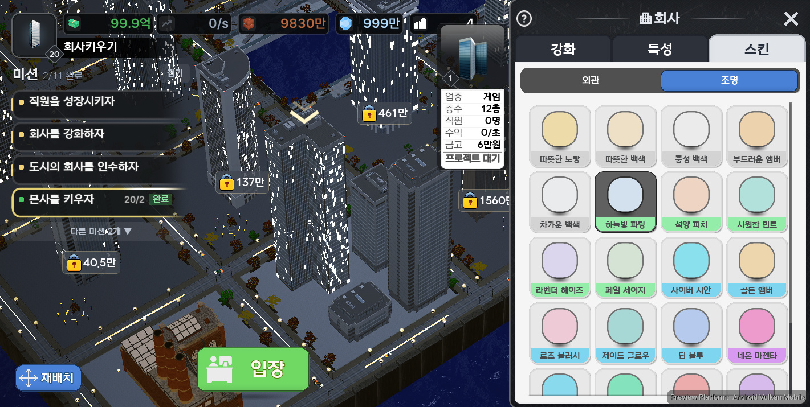
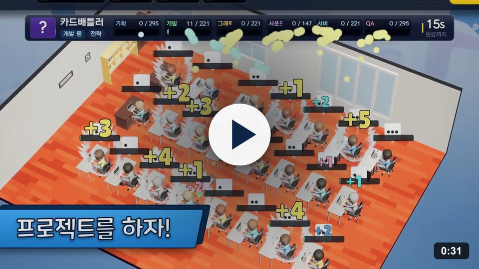
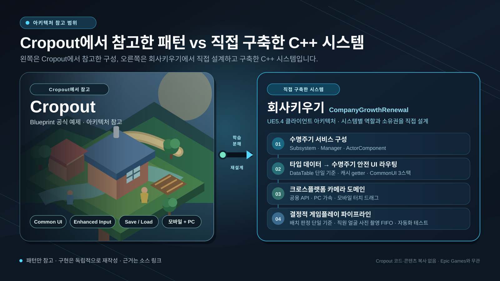
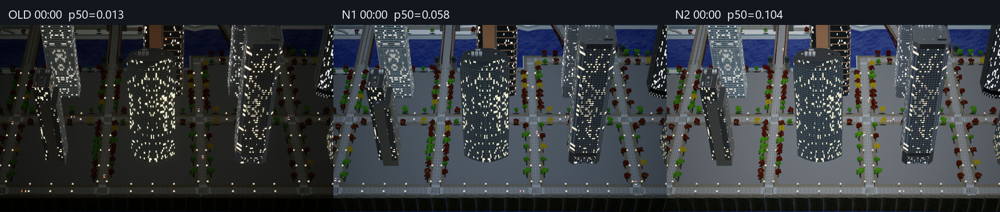

# 회사키우기 : 방치형 도시 타이쿤

**Unreal Engine 5.4 C++ client architecture for a cross-platform idle city tycoon**

  
  
  
  
  

Android Vulkan ES3.1 in-engine rendering preview · 야간 도시 + 미션 HUD + 회사 스킨·조명 UI 
자체 클라이언트 시스템·라이팅·모바일 검증을 보여주는 화면이며, 라이선스된 제3자 시각 에셋의 원저작권을 주장하지 않습니다.

 

<b>Demo Trailer</b> · 31s · 전 구간 인게임 촬영 · 2026 Q4 출시예정 
건물 성장 · 외관/조명 스킨 · 직원 채용 · 프로젝트 시뮬레이션 · 방치 수익 · 도시 인수

  <a href="https://cookie-roquefort-35d.notion.site/2626907ae0ce8030b6edd2bdb5ae4931"><b>Project Overview</b></a>
  &nbsp;·&nbsp;
  <a href="https://www.youtube.com/watch?v=lzwi1ru7XzU"><b>Demo Trailer</b></a>
  &nbsp;·&nbsp;
  <a href="docs/ARCHITECTURE.md"><b>Architecture</b></a>
  &nbsp;·&nbsp;
  <a href="#code-tour"><b>Code Tour</b></a>
  &nbsp;·&nbsp;
  <a href="docs/TROUBLESHOOTING.md"><b>Troubleshooting</b></a>

<code>2025.11 – Present</code> · <code>Individual Development</code> · <code>UE5.4 / C++</code>

> [!NOTE]
> 라이선스 에셋, 레벨, WBP·DataTable 에셋, 운영 설정과 외부 플러그인 바이너리를 제외한 **source-only snapshot**입니다. 이 저장소만으로 완성 게임을 실행하거나 전체 UE 빌드를 재현할 수는 없습니다.

<table>
  <tr>
    <td align="center"><strong>878</strong> Source files</td>
    <td align="center"><strong>62</strong> C++ test files</td>
    <td align="center"><strong>148</strong> Test declarations</td>
    <td align="center"><strong>239</strong> Runnable tool checks passed</td>
  </tr>
</table>

[Cropout → C++](#cropout-redesign) · [Highlights](#engineering-highlights) · [Architecture](#system-architecture) · [Validation](#visual-validation) · [Code](#code-tour) · [Problems](#troubleshooting) · [AI Workflow](#ai-workflow) · [Verification](#verification)

---

## 1. Cropout Reference → C++ Redesign

  
   
  <b>Learned from Cropout</b> — Common UI · Enhanced Input · Save/Load · Mobile/PC baseline 
  <b>Built for this project</b> — lifecycle topology · typed data/UI routing · camera domain · deterministic gameplay pipelines 
  Official learning reference · <a href="https://www.unrealengine.com/blog/cropout-casual-rts-game-sample-project">Epic Games — Cropout Sample Project</a>

[Cropout](https://www.unrealengine.com/blog/cropout-casual-rts-game-sample-project)은 Epic Games가 Blueprint로 제작한 크로스플랫폼 예시 프로젝트입니다. 이 프로젝트에서 가져온 것은 코드나 콘텐츠가 아니라 Common UI, Enhanced Input, Save/Load, Blueprint Interface와 모바일·PC 패키징을 구성하는 **설계 기준과 사용 패턴**입니다.

반면 **회사키우기에서 새로 쌓은 시스템**은 장기 수명 서비스의 책임 경계, 타입이 보장되는 DataTable SOT, CommonUI 3-Stack 라우터, PC·터치 공용 카메라 도메인, 배치 판정 SSOT와 초상화 FIFO 같은 결정적 파이프라인입니다. 단순 포팅이 아니라 게임 규모와 수명주기에 맞춰 C++로 분해하고 다시 설계했습니다.

| Cropout에서 학습한 기준 | CompanyGrowthRenewal에서 직접 재설계한 구조 | Evidence |
|---|---|---|
| 크로스플랫폼 탑다운 구조 | 장기 수명 서비스와 월드 객체를 <code>GameInstanceSubsystem · Manager · ActorComponent</code>로 분리 | [CGGameInstance.cpp](Source/CompanyGrowthRenewal/Private/Core/CGGameInstance.cpp), [Architecture](docs/ARCHITECTURE.md) |
| Common UI 활용 | Main·Prompt·Bottom 3-Stack 라우터와 입력 모드 수명주기 중앙화 | [UIBase.cpp](Source/CompanyGrowthRenewal/Private/UI/UIBase.cpp), [UIManagerSubsystem.cpp](Source/CompanyGrowthRenewal/Private/Manager/UIManagerSubsystem.cpp) |
| Enhanced Input | PC 가속 이동과 모바일 터치 드래그를 분리하고 카메라 도메인 API는 공유 | [MovementInputHandler.cpp](Source/CompanyGrowthRenewal/Private/Player/Components/MovementInputHandler.cpp), [PlayerCamera.cpp](Source/CompanyGrowthRenewal/Private/Player/PlayerCamera.cpp) |
| Blueprint 데이터 흐름 | 명시적 C++ 타입과 DataTable SOT·캐시·Loud Failure 파이프라인 구축 | [TableManagerSubsystem.cpp](Source/CompanyGrowthRenewal/Private/Manager/TableManagerSubsystem.cpp), [CSV sample](DataImport/Samples/DT_WidgetClass_Import.csv) |
| Blueprint Interface로 책임을 나누는 방식 | 미리보기·확정이 공유하는 배치 판정 SSOT, 초상화 FIFO와 자동화 테스트로 결정적 파이프라인 구축 | [PlacementHandler.cpp](Source/CompanyGrowthRenewal/Private/Player/Components/PlacementHandler.cpp), [EmployeeManager.cpp](Source/CompanyGrowthRenewal/Private/Manager/EmployeeManager.cpp), [PlotPlacementRulesTests.cpp](Source/CompanyGrowthRenewal/Private/Tests/PlotPlacementRulesTests.cpp) |

> Cropout은 구조 학습 기준이며 이 저장소는 독립 프로젝트입니다. Epic Games와 제휴하거나 공식 승인을 받은 저장소가 아니며, Cropout 프로젝트 파일의 코드와 게임 콘텐츠는 포함하지 않습니다.

## 2. Engineering Highlights

| Engineering decision | 구조적 가치 | Evidence |
|---|---|---|
| **Subsystem lifecycle boundaries** | 레벨 전환 후 유지할 도메인 상태와 월드 종속 표현을 분리 | [Architecture](docs/ARCHITECTURE.md) |
| **Data-driven content pipeline** | 위젯 클래스·표시 문자열·밸런스를 코드 수정 없이 CSV Reimport로 교체 | [TableManager](Source/CompanyGrowthRenewal/Private/Manager/TableManagerSubsystem.cpp), [Widget row](Source/CompanyGrowthRenewal/Public/Table/WidgetDataTable.h) |
| **CommonUI stack routing** | 화면·모달·하단 시트의 생성, 활성화와 입력 모드를 하나의 경로로 관리 | [UIBase](Source/CompanyGrowthRenewal/Public/UI/UIBase.h), [Animated widget](Source/CompanyGrowthRenewal/Private/UI/AnimatedActivatableWidget.cpp) |
| **Save & offline settlement** | 로드 완료 가드, 저장 스로틀과 서버 시간 기반 경과 계산으로 상태 안전성 확보 | [SaveLoadManager](Source/CompanyGrowthRenewal/Public/Manager/SaveLoadManager.h), [Offline report](Source/CompanyGrowthRenewal/Private/UI/Panel/OfflineReportModalWidget.cpp) |
| **PC / mobile input split** | 플랫폼별 체감은 별도 경로로 튜닝하고 게임 도메인 동작은 공유 | [Camera movement](docs/01_Systems/Player/CAMERA_MOVEMENT_SYSTEM.md) |
| **Backend contract boundaries** | PlayFab 인증·서버시간·랭킹과 Firebase HTTP/JSON 클라이언트의 권위·오류 경계 분리 | [Backend architecture](docs/01_Systems/Backend/BACKEND_ARCHITECTURE.md) |

## 3. System Architecture

~~~mermaid
flowchart TB
    INPUT["Enhanced Input PC · Mobile"] --> PC["PlayerController"]
    PC --> COMPONENTS["Input · Camera · Placement Components"]

    GI["UCGGameInstance Level transition · cross-map state"] --> SERVICES

    subgraph SERVICES["GameInstanceSubsystem domain services"]
        TABLE["TableManager"]
        SAVE["SaveLoad"]
        UI["UIManager"]
        GAME["Employee · Building · Mission · Production"]
        NET["PlayFab · Ranking · Firebase Chat"]
    end

    CSV["CSV · DataTables"] --> TABLE
    TABLE --> GAME
    COMPONENTS --> GAME
    GAME --> SAVE
    NET --> SAVE
    GAME --> UI
    UI --> STACK["CommonUI Main · Prompt · Bottom"]
~~~

- <code>CSV → Table cache → Domain/UI</code>: 콘텐츠와 표시 데이터를 코드 분기에서 분리합니다.
- <code>Input → Controller/Component → Domain</code>: 플랫폼 입력과 게임 규칙의 책임을 나눕니다.
- <code>Server time → Offline settlement → Pending report → CommonUI</code>: 계산과 표현의 소비 시점을 분리합니다.

## 4. Visual Validation

  
   
  p50 = 이미지 픽셀 선형 휘도의 중앙값 · OLD 0.013(과도하게 어두움) · N1 0.058(휴리스틱 0.045–0.065 범위) · N2 0.104(과도하게 밝은 비교 후보) 
  스크린샷의 제3자 시각 에셋은 검증 장면에만 사용되며 저장소에 포함하거나 직접 제작한 아트로 주장하지 않습니다.

야간 화면 문제를 감각적인 수동 튜닝으로 처리하지 않고 노출·AA·Tonemapper·해상도를 독립 변수로 분리했습니다. OLD·N1·N2는 최종 설정으로 저장한 값이 아니라, 동일 구도에서 휴리스틱의 통과 구간과 과보정 경계를 확인한 A/B 후보입니다. 캡처와 밝기 시계열로 가설을 기각한 뒤 설정과 판정 스크립트를 재사용 가능한 검증 도구로 남겼습니다.

- [모바일 렌더링 기록](docs/08_Optimization/MOBILE_RENDERING.md)
- [Flickering·Shimmer 진단](docs/07_Reference/TROUBLESHOOTING_FLICKERING.md)
- [Night readability validator](Tools/MainMapPreview/validate_night_readability_ab.py)

## 5. Code Tour

| Area | 핵심 설계 | Starting points |
|---|---|---|
| **Subsystem Architecture** | 레벨을 넘어 유지되는 서비스와 월드 객체의 수명주기 분리 | [CGGameInstance.cpp](Source/CompanyGrowthRenewal/Private/Core/CGGameInstance.cpp) [SoundManagerSubsystem.h](Source/CompanyGrowthRenewal/Public/Manager/SoundManagerSubsystem.h) |
| **DataTable Pipeline** | 생성자 로드 → 초기화 캐시 → 타입별 Getter → 빈 값과 경고 | [TableManagerSubsystem.h](Source/CompanyGrowthRenewal/Private/Manager/TableManagerSubsystem.h) [TableManagerSubsystem.cpp](Source/CompanyGrowthRenewal/Private/Manager/TableManagerSubsystem.cpp) [CSV samples](DataImport/Samples) |
| **CommonUI Stack** | <code>EWidgetType → DT_WidgetClass → TableManager → Stack Push</code> | [UIBase.cpp](Source/CompanyGrowthRenewal/Private/UI/UIBase.cpp) [UIManagerSubsystem.cpp](Source/CompanyGrowthRenewal/Private/Manager/UIManagerSubsystem.cpp) |
| **Save & Offline** | 로드 가드, 지연 저장, SaveData 집계와 오프라인 결과 전달 | [SaveLoadManager.cpp](Source/CompanyGrowthRenewal/Private/Manager/SaveLoadManager.cpp) [GameSaveData.h](Source/CompanyGrowthRenewal/Public/Data/GameSaveData.h) [Round-trip test](Source/CompanyGrowthRenewal/Private/Tests/OfficeExteriorSaveRoundTripTests.cpp) |
| **Input & Camera** | PC 가속 이동·모바일 드래그·줌·회전·포커싱 상태 전이 | [PlayerCamera.cpp](Source/CompanyGrowthRenewal/Private/Player/PlayerCamera.cpp) [MovementInputHandler.cpp](Source/CompanyGrowthRenewal/Private/Player/Components/MovementInputHandler.cpp) [InputTypeManager.cpp](Source/CompanyGrowthRenewal/Private/Player/InputTypeManager.cpp) |
| **PlayFab & Firebase** | 인증·플레이어 데이터·서버시간·랭킹·채팅 계약과 오류 경계 | [PlayFabManagerSubsystem.cpp](Source/CompanyGrowthRenewal/Private/Manager/PlayFabManagerSubsystem.cpp) [RankingManagerSubsystem.cpp](Source/CompanyGrowthRenewal/Private/Manager/RankingManagerSubsystem.cpp) [ChatManagerSubsystem.cpp](Source/CompanyGrowthRenewal/Private/Manager/ChatManagerSubsystem.cpp) |
| **Tests & Tools** | 상태 불변식, 밸런스, 렌더링 A/B와 C++·문서 동기화 자동화 | [Atomic commit rules](Source/CompanyGrowthRenewal/Private/Tests/TutorialMissionAtomicCommitRulesTests.cpp) [Balance assertions](Tools/Balance/verify/assertions.js) [Cheat doc guard](Tools/CheatDoc/verify_cheat_docs.py) |
| **Engineering Playbooks** | 반복 실패를 코드 수정으로 끝내지 않고 재발 방지 규칙으로 전환 | [Capabilities map](docs/07_Reference/CAPABILITIES_MAP.md) [UI playbook](docs/05_UI/UI_CREATION_PLAYBOOK.md) [Backend playbook](docs/01_Systems/Backend/BACKEND_PLAYBOOK.md) |

## 6. Troubleshooting

| Case | Root cause & approach | Prevention | Evidence |
|---|---|---|---|
| **건물 포커스 프레이밍** | 줌값 하나가 팔길이·피치·FOV를 동시에 바꾸는 SSOT 설계라 화면 점유율→줌값 역산이 순환. 수렴 반복+이진탐색으로 프레이밍, 초고층은 바닥 고정, 가림 건물은 골조 고스트, 오피스는 8모서리 safe-frame 탐색 | 계산용 상태 복원 규칙, 순수 수학층 유닛 테스트, PIE 체크리스트 | [카메라 SOT](docs/01_Systems/Player/CAMERA_MOVEMENT_SYSTEM.md), [PlayerCamera.cpp](Source/CompanyGrowthRenewal/Private/Player/PlayerCamera.cpp), [FocusOcclusionHandler.cpp](Source/CompanyGrowthRenewal/Private/Player/Components/FocusOcclusionHandler.cpp), [4막 기록](https://cookie-roquefort-35d.notion.site/4-3c76907ae0ce81d2ab67e774ca6e714e) |
| **Android 야간 Shimmer** | 정지 화질 문제가 아니라 오토 노출의 시간축 진동으로 분리. AA·노출·Tonemapper를 동일 조건 A/B로 검증 | 플랫폼 노출 정책, 자동 캡처와 정량 validator | [렌더링 기록](docs/08_Optimization/MOBILE_RENDERING.md), [validator](Tools/MainMapPreview/validate_night_readability_ab.py) |
| **건물 파츠 깜빡임** | 프러스텀 컬링으로 추정해 콜리전 바운드·BoundsScale·bUseAsOccluder를 차례로 기각한 뒤 <code>r.AllowOcclusionQueries 0</code>으로 Hardware Occlusion Query를 확정. 탑다운에서는 쿼리 이득이 없어 전역 비활성화 | 컴포넌트 단위 컬링 방어 설정, 컬링 종류별 제어 노브 표 | [진단 기록](docs/07_Reference/TROUBLESHOOTING_FLICKERING.md), [BuildingBaseActor.cpp](Source/CompanyGrowthRenewal/Private/Entity/Building/BuildingBaseActor.cpp) |
| **UMG 좌표 오차** | Screen·Viewport·Canvas 좌표를 혼용해 SafeZone·DPI에서 위치가 어긋남 | <code>LocalToAbsolute → AbsoluteToLocal</code> 변환을 공통 규칙으로 고정 | [UI playbook](docs/05_UI/UI_CREATION_PLAYBOOK.md), [적용 코드](Source/CompanyGrowthRenewal/Private/UI/Panel/InGameLayerWidget.cpp) |
| **Android 에셋 누락** | Soft Reference 자체가 아니라 C++ 문자열 진입점을 쿠커가 발견하지 못한 문제 | 쿠킹 도달성을 기준으로 첫 문자열 경로만 수동 등록 | [원인과 검증](docs/TROUBLESHOOTING.md#android-cooking), [적용 코드](Source/CompanyGrowthRenewal/Private/UI/HUD/MissionGuideOverlayWidget.cpp) |
| **저장 초기화·연타 히칭** | 로드 전 저장과 고빈도 동기 쓰기가 데이터 손상·프레임 끊김을 유발 | 로드 완료 가드와 첫 요청 기준 3초 저장 스로틀 | [SaveLoadManager](Source/CompanyGrowthRenewal/Private/Manager/SaveLoadManager.cpp), [Round-trip test](Source/CompanyGrowthRenewal/Private/Tests/OfficeExteriorSaveRoundTripTests.cpp) |

[문제 해결 과정과 코드 근거 자세히 보기 →](docs/TROUBLESHOOTING.md)

## 7. AI-Assisted Engineering Workflow

기본 아키텍처, 시스템 경계, 데이터 흐름, 완료 조건과 최종 채택·기각은 직접 결정했습니다. AI는 기존 API 탐색, 영향 범위 분석, 복수 가설 생성, 반복 구현과 독립 리뷰의 처리량을 높이는 도구로 사용했습니다.

~~~text
직접 정의한 제약·SOT·완료 조건
→ 역할별 탐색 · 설계 · 구현 · 리뷰
→ 로그와 측정값으로 가설 기각·채택
→ UBT · Automation Test · PIE · Android 실기기 검증
→ Test · Skill · Hook · Playbook으로 재발 방지
~~~

| 실제 문제 | AI로 확장한 처리량 | 직접 내린 판단과 검증 |
|---|---|---|
| **Android 야간 가독성·Shimmer** | 관련 CVar와 설정 영향 범위 탐색, A/B 캡처·지표 스크립트 작성, 독립 리뷰 병렬화 | 시간축 문제와 정지 화질을 분리하고 변수·허용 구간을 정의. Android Vulkan 동일 조건 결과로 후보를 채택·기각 |
| **Save/Load 수명주기** | 호출부·직렬화 필드의 교차 탐색, Round-trip 테스트 골격과 누락 경로 검토 | 저장 책임 경계, 로드 완료 가드와 스로틀 정책을 결정하고 코드·테스트 대칭성 확인 |
| **반복되는 구현 실수** | 기존 사고를 규칙·Hook·테스트·문서 동기화 도구로 전환하는 반복 작업 가속 | SOT와 실패 조건을 직접 정의하고, 자동 검사가 실제 누락을 차단하는지 회귀 테스트 |

측정하지 않은 시간 절감률을 주장하지 않고, 저장소에 남은 코드·테스트·검증 도구로 확인할 수 있는 활용만 기술합니다.

| 운영 증거 | 확인 위치 |
|---|---|
| Codex 프로젝트 엔지니어링 규칙 | [AGENTS.md](AGENTS.md) |
| Claude Code 역할·Hook·작업 원칙 | [CLAUDE.md](CLAUDE.md), [.claude/agents](.claude/agents), [.claude/hooks](.claude/hooks) |
| 반복 가능한 분석·리뷰 Skill | [.agents/skills](.agents/skills) |
| 개발자와 AI의 책임 경계 | [AI_WORKFLOW.md](docs/AI_WORKFLOW.md) |

## 8. Verification

| 검증 | 현재 revision에서 확인한 결과 |
|---|---|
| Node balance simulator | 135개 중 129개 통과 · 6개 조건부 스킵 · 실패 0 |
| Python rendering contracts | 110개 통과 · 실패 0 |
| Cheat command documentation | C++ <code>Exec</code> 명령 85개와 Markdown·HTML 문서 일치 |
| C++ Automation Test | 62개 소스 · 148개 선언 포함. 제외된 맵·에셋·플러그인이 필요하므로 전체 통과를 주장하지 않음 |

수치 기준은 [SNAPSHOT.md](SNAPSHOT.md)에 고정했습니다. 빌드 성공과 런타임 성공, Editor와 Android 실기기 성공을 서로 대신하는 증거로 사용하지 않습니다.

<strong>Runnable checks 재현 명령 보기</strong>

~~~powershell
node --test "Tools/Balance/test/*.test.js"
py -3 -m unittest discover -s Tools/MainMapPreview -p "test_*.py"
py -3 Tools/CheatDoc/verify_cheat_docs.py
~~~

Python 렌더링 검증은 <code>NumPy</code>와 <code>Pillow</code>가 필요합니다.

## 9. Repository Scope

<strong>포함·제외 범위와 빌드 제한 보기</strong>

### Included

- 프로젝트 <code>Source</code> 전체
- C++ Automation Test 소스
- 선별한 DataTable CSV 샘플
- 밸런스·렌더링·문서 동기화 도구
- 아키텍처·UI·입력·백엔드·최적화 기술 문서
- Agent·Skill·Hook과 AI 협업 규칙

### Excluded

- <code>Content</code>, 맵, WBP·DataTable 에셋과 외부/Fab/Marketplace 에셋
- 실제 <code>Config</code>, PlayFab·Firebase 값과 운영 배포 주소
- Firebase 서버 구현, <code>Plugins</code>, 바이너리와 빌드·캐시 결과
- 비공개 게임 기획과 Azure Git 히스토리

<code>CompanyGrowthRenewal.uproject</code>는 UE5.4와 의존성을 설명하기 위해 포함했습니다. 실제 실행에는 공개하지 않은 콘텐츠와 <code>AsyncLoadingScreen</code>, <code>NiagaraUIRenderer</code>, <code>PlayFab</code> 등의 외부 플러그인이 필요합니다.

## Technical Documents

- [Architecture overview](docs/ARCHITECTURE.md)
- [Level & lifecycle architecture](docs/00_Core/ARCHITECTURE.md)
- [UI creation playbook](docs/05_UI/UI_CREATION_PLAYBOOK.md)
- [UI style catalog](docs/05_UI/UI_STYLE_CATALOG.md)
- [Typography rules](docs/05_UI/UI_TYPOGRAPHY.md)
- [Reusable API map](docs/07_Reference/CAPABILITIES_MAP.md)
- [Performance optimization](docs/08_Optimization/PERFORMANCE_OPTIMIZATION.md)

## Links & Notice

- [Notion project overview](https://cookie-roquefort-35d.notion.site/2626907ae0ce8030b6edd2bdb5ae4931)
- Developer: **Jinhwan Lee (이진환)**
- Third-party names and images remain the property of their respective owners.
- Project-specific source and documentation: Copyright © 2025–2026 Jinhwan Lee. All rights reserved.

See [NOTICE.md](NOTICE.md) for third-party attribution and repository terms.

