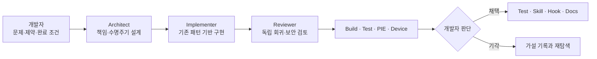

# AI 활용 워크플로

## 핵심 원칙

이 프로젝트에서 AI는 제품과 아키텍처를 대신 소유하는 주체가 아니라, 탐색·구현·리뷰·검증의 처리량을 높이는 도구입니다. 기본 구조, 시스템 경계, 데이터 흐름, 완료 조건과 최종 채택·기각은 개발자가 결정합니다.

## 역할 분리



설계·구현·리뷰·모바일 최적화 역할은 `.claude/agents/`와 `.codex/agents/`에 분리했습니다. 한 역할이 자신의 결과를 그대로 승인하지 않도록 리뷰 경계를 둡니다.

## 문제 접근 방식

```text
현상 수집
→ 기존 구조와 의존성 탐색
→ 코드·엔진·데이터·플랫폼별 가설 분리
→ 최소 재현
→ 로그·시계열·실기기 측정
→ 가설 기각 또는 채택
→ 최소 변경 구현
→ 독립 리뷰
→ 자동 가드로 재발 방지
```

예를 들어 야간 Shimmer는 선명화 수치 하나를 임의로 바꾸지 않고 노출, AA, 리샘플링, 시간대 변수를 분리했습니다. 동일 구도 캡처와 밝기 시계열로 오토 노출 진동을 확인한 뒤 고정 노출 정책과 검증 스크립트로 전환했습니다.

## 생산성 향상 지점

- 주요 헤더와 호출부의 병렬 탐색
- 기존 API 재사용 후보와 영향 범위 수집
- DataTable·WBP 제작 스크립트와 CSV 검증
- Vulkan A/B 캡처와 이미지 지표 계산
- 반복되는 코드 리뷰 체크리스트의 Skill화
- C++ 선언과 문서의 동기화 Hook
- 구현 후 독립 역할의 회귀·보안 검토

## 저장소에 남은 증거

- [프로젝트 공통 규칙](../AGENTS.md)
- [Claude Code 규칙](../CLAUDE.md)
- [역할별 Agent](../.claude/agents/)
- [공유 Skill](../.agents/skills/)
- [Claude Skill](../.claude/skills/)
- [편집 전후 Hook](../.claude/hooks/)
- [C++ Automation Tests](../Source/CompanyGrowthRenewal/Private/Tests/)
- [Cheat 문서 동기화 도구](../Tools/CheatDoc/verify_cheat_docs.py)
- [정량 렌더링 검증](../Tools/MainMapPreview/validate_night_readability_ab.py)

## 정확성 원칙

- 선언된 테스트 수를 전체 통과 수로 표현하지 않습니다.
- Git 공동 작성 메타데이터를 코드 기여율로 환산하지 않습니다.
- 측정하지 않은 플랫폼과 빌드를 완료로 표기하지 않습니다.
- AI가 생성한 코드도 개발자가 구조·실패 경로·검증 결과를 이해한 경우에만 채택합니다.
