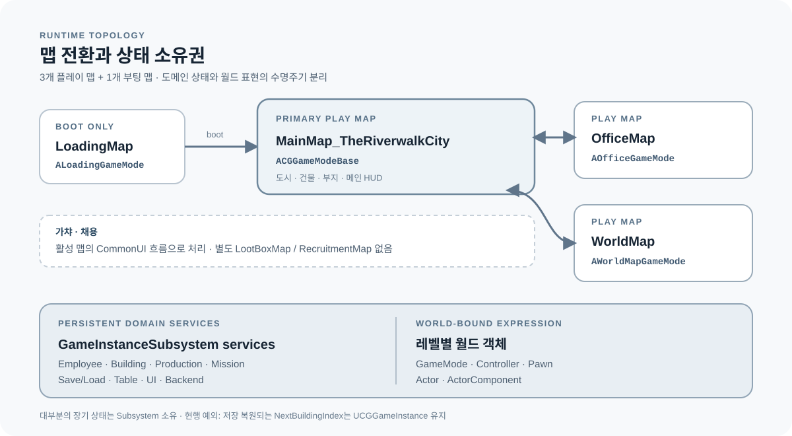

# 클라이언트 아키텍처 개요

## 수명주기 분리

`UCGGameInstance`는 범용 레벨 전환과 오피스·방문 진입 컨텍스트를 담당하며, 저장 복원되는 `NextBuildingIndex` 발급도 현행 예외로 남아 있습니다. 그 외 직원, 건물, 생산, 미션, UI, 저장, 랭킹과 채팅 등 대부분의 장기 상태는 GameInstanceSubsystem 계열 서비스가 소유합니다. 월드에 종속되는 표현과 입력은 GameMode, Controller, Pawn, ActorComponent에 남깁니다.



런타임은 `LoadingMap` 부팅 후 `MainMap_TheRiverwalkCity`, `OfficeMap`, `WorldMap` 3개 플레이 맵으로 전환합니다. 가챠와 채용은 별도 레벨이 아니라 활성 맵의 CommonUI 흐름입니다.

```text
UCGGameInstance
├─ 범용 레벨 전환·진입 컨텍스트
├─ NextBuildingIndex 발급 (현행 예외)
├─ GameInstanceSubsystem
│  ├─ Table / UI / SaveLoad
│  ├─ Employee / Building / Mission
│  ├─ Production / Mine / Trade
│  └─ PlayFab / Ranking / Chat
└─ Level
   └─ GameMode / Controller / Pawn / ActorComponent
```

## DataTable 파이프라인

```text
CSV
→ FTableRowBase 구조체
→ ConstructorHelpers 로드
→ TableManager Initialize 캐시
→ 타입별 Getter
→ Manager·UI 소비
```

표시 텍스트와 콘텐츠 매핑은 코드 분기에서 분리합니다. 누락된 Row는 경고와 빈 결과로 드러내 Reimport 누락을 조기에 발견합니다.

## UI 라우팅

```text
EWidgetType
→ DT_WidgetClass
→ TableManagerSubsystem
→ UIManagerSubsystem
→ UIBase Main / Prompt / Bottom Stack
```

특정 WBP 경로를 화면 호출부에 하드코딩하지 않고 역할 기반으로 위젯을 조회합니다. 패널 수명주기와 입력 모드 복원은 Stack 경계에서 관리합니다.

## 저장

도메인별 SaveData를 `USaveGame_GameData`가 집계합니다. 최초 로드 완료 가드, 고빈도 변경의 지연 저장, 저장·로드 대칭 테스트를 사용해 초기화 순서와 디스크 쓰기 문제를 줄입니다.

## 플랫폼 입력

PC는 키보드 가속·경계 저항 이동, 모바일은 터치 드래그 이동을 사용합니다. 줌·회전·포커싱의 공개 카메라 API는 공유하되 입력 상태 전이는 분리해 플랫폼 체감 차이를 보존합니다.

더 상세한 레벨 구조는 [원본 기술 문서](00_Core/ARCHITECTURE.md), 재사용 API는 [Capabilities Map](07_Reference/CAPABILITIES_MAP.md)을 참고하세요.
