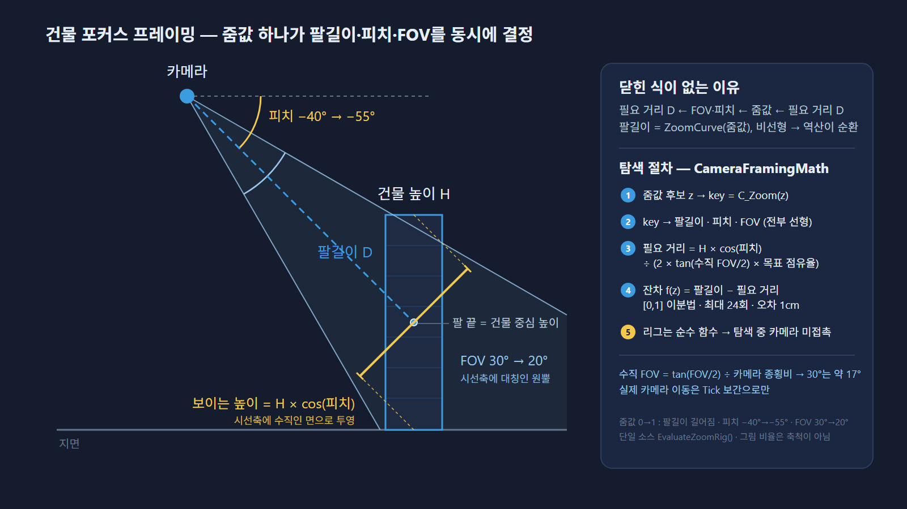

# 대표 트러블슈팅

## 1. 야간 Flickering·Shimmer

### 문제

모바일 Vulkan 야간 화면에서 밝기와 윤곽이 프레임마다 흔들리는 현상이 발생했습니다.

### 접근

노출, AA, 리샘플링, Tonemapper 선명화를 독립 변수로 나누고 동일 구도·시간대의 A/B 캡처와 밝기 시계열을 비교했습니다. 정지 화면이 선명하다는 이유만으로 시간축 Shimmer 해결을 주장하지 않았습니다.

### 결과

오토 노출 진동을 확인해 모바일 고정 노출 정책으로 전환하고, 정량 검증 스크립트를 재사용 가능한 도구로 남겼습니다.

- [진단 플레이북](07_Reference/TROUBLESHOOTING_FLICKERING.md)
- [모바일 렌더링 기록](08_Optimization/MOBILE_RENDERING.md)
- [검증 스크립트](../Tools/MainMapPreview/validate_night_readability_ab.py)

## 2. UMG 좌표 공간 불일치

### 문제

모바일 SafeZone과 DPI가 적용되면 월드 좌표 기반 UI가 다른 위치에 나타났습니다.

### 접근과 결과

Screen 좌표를 ViewportScale로 나누는 가정을 제거하고, Viewport Local → Absolute → Target Canvas Local 변환으로 통일했습니다. 중첩 컨테이너와 SafeZone 보정을 Geometry에 맡겼습니다.

- [UI 생성 플레이북](05_UI/UI_CREATION_PLAYBOOK.md)
- [대표 적용부](../Source/CompanyGrowthRenewal/Private/UI/Panel/InGameLayerWidget.cpp)

## 3. 저장 초기화 순서

### 문제

최초 로드가 끝나기 전에 저장이 실행되면 빈 런타임 상태가 기존 세이브를 덮을 수 있었습니다.

### 접근과 결과

로드 완료 전 저장을 차단하고, 고빈도 변경은 지연 저장으로 통합했습니다. 저장·로드 구조가 바뀔 때 Round Trip 테스트로 직렬화 대칭성을 확인합니다.

- [SaveLoadManager.cpp](../Source/CompanyGrowthRenewal/Private/Manager/SaveLoadManager.cpp)
- [Round Trip 테스트](../Source/CompanyGrowthRenewal/Private/Tests/OfficeExteriorSaveRoundTripTests.cpp)

## 4. Blueprint 직렬화 잔재

### 문제

에디터 세션에서 저장된 동적 머티리얼 참조가 다시 로드되며 런타임 생성 상태를 오염시키는 문제가 있었습니다.

### 접근과 결과

메모리상의 현재 포인터 유효성만 검사하지 않고, 직렬화된 로드 객체인지 구분해 런타임 인스턴스를 재생성했습니다. 결과를 특정 에셋의 우연한 수정이 아니라 객체 수명주기 규칙으로 일반화했습니다.

- [직렬화된 MID를 판별해 재생성하는 구현](../Source/CompanyGrowthRenewal/Private/Entity/Officeworker/StickOfficeworker.cpp)

## 5. Android 쿠킹 도달성

### 문제

에디터에서는 정상 표시되던 UI 머티리얼·텍스처가 Android 패키지에서만 누락됐습니다. C++ 런타임 문자열로 시작되는 진입 에셋은 쿠커가 정적으로 발견할 수 없었고, 그 아래의 직렬화된 참조까지 함께 도달하지 못했습니다.

### 접근과 결과

하드·소프트 참조라는 분류보다 **쿠커가 최초 참조를 볼 수 있는지**를 기준으로 의존성 경로를 추적했습니다. 런타임 문자열이 첫 진입점인 폴더만 수동 쿠킹 대상으로 등록하고, 이후 DataAsset·DataTable에 직렬화된 참조는 의존성 그래프가 따라가도록 구성했습니다. 직렬화된 <code>TSoftObjectPtr</code> 필드는 <code>IsNull()</code>로 경로 존재를 확인하고, 문자열 진입점은 <code>FSoftObjectPath</code>로 포인터를 구성해 <code>LoadSynchronous()</code>의 실패를 로그로 드러냅니다. 마지막으로 패키징 결과물과 실기기 화면에서 포함 여부를 확인합니다.

- [모바일·쿠킹 규칙](../AGENTS.md#모바일쿠킹-규칙)
- [런타임 문자열 진입 에셋 로드 구현](../Source/CompanyGrowthRenewal/Private/UI/HUD/MissionGuideOverlayWidget.cpp)

## 6. 건물 포커스 프레이밍 — 요구가 네 번 바뀐 카메라

  
   
  줌값 하나가 팔길이·피치·FOV를 동시에 바꾸므로 "화면 점유율 → 줌값" 역산이 순환한다

### 문제

건물 관리 패널을 열 때 건물이 화면의 일정 비율을 차지하도록 카메라를 맞춰야 했습니다. 그런데 이 프로젝트의 카메라는 <code>ZoomValue</code> 하나가 SpringArm 길이·피치(-40°→-55°)·FOV(30°→20°)를 동시에 결정하는 단일 진실 소스 설계라, 필요한 거리 ← FOV·피치 ← 줌값 ← 필요한 거리로 역산이 순환하고, 팔길이는 비선형 <code>ZoomCurve</code>라 닫힌 식이 없습니다.

### 접근과 결과

1. **높이 비례 프레이밍** — 외부 5회 수렴 × 내부 15회 이진탐색으로 <code>ZoomValue</code>를 역산하고, <code>cos(pitch)</code>로 수직 압축을 보정했습니다. 첫 구현은 보정 방향이 반대였고 로그(줌값 0.079, 거리 7,258cm)로 발견해 수정했습니다. 계산 중 바꾼 줌 상태는 항상 복원하고 실제 이동은 Tick 보간으로만 합니다.
2. **층수 증축과 초고층** — 높이→점유율 보간에 상한이 없어 초고층에서 카메라가 너무 멀어졌습니다. 화면 위치를 직접 지정하고, 높이 20,000cm 이상은 바닥을 하단 10%에 고정하고 꼭대기는 포기합니다. 증축 성공 이벤트에서 재프레이밍합니다.
3. **시야 가림 고스트** — 포커스가 Yaw를 고려하지 않아 앞줄 건물이 타깃을 가렸습니다. 처음에는 가리는 건물의 머티리얼을 반투명으로 바꾸려 했으나 Android 빌드에서 반투명 머티리얼이 적용되지 않았고(모바일 렌더 예산상 반투명 유리 미사용), 층별 ISM이라 정렬이 무너지고 창문 발광이 손실됐습니다. 건물끼리의 바운드 겹침으로 가림을 판별하는 방식도 카메라 각도에 따라 답이 달라져 기준이 애매했습니다. 카메라 회전(밀집 지역엔 빈 각도가 없음)까지 기각한 뒤, 라인트레이스 5발로 가림 건물을 찾아 본체를 숨기고 볼록 큐브 1개를 반투명 골조로 띄웁니다. 판정(<code>UFocusOcclusionHandler</code>)과 표현(건물 액터)을 분리해 순수 수학층만 유닛 테스트로 덮습니다.
4. **오피스 고층 외관 프레이밍** — 로드 완료 후 1회, 열린 코너와 파사드 첫 4m를 hero box로 잡고 8모서리를 실제 피치·팔길이·FOV·종횡비로 투영해 정규화 화면 안에 드는 가장 가까운 줌을 32구간 순차 탐색 + 8회 정제로 찾습니다. 단조성을 가정하지 않으며, 확장 이벤트에는 바인딩하지 않아 플레이어 시점을 보존합니다.

- [카메라 SOT](01_Systems/Player/CAMERA_MOVEMENT_SYSTEM.md)
- [PlayerCamera.cpp](../Source/CompanyGrowthRenewal/Private/Player/PlayerCamera.cpp) · [MovementInputHandler.cpp](../Source/CompanyGrowthRenewal/Private/Player/Components/MovementInputHandler.cpp)
- [FocusOcclusionHandler.cpp](../Source/CompanyGrowthRenewal/Private/Player/Components/FocusOcclusionHandler.cpp) · [FocusOcclusionTests.cpp](../Source/CompanyGrowthRenewal/Private/Tests/FocusOcclusionTests.cpp)
- [OfficeCameraFraming.cpp](../Source/CompanyGrowthRenewal/Private/Player/OfficeCameraFraming.cpp)
- [4막 전체 기록 (Notion)](https://cookie-roquefort-35d.notion.site/4-3c76907ae0ce81d2ab67e774ca6e714e)

## 검증 원칙

문제를 고쳤다는 표현은 원래 현상을 재현하는 증거가 사라졌을 때만 사용합니다. 빌드 성공은 런타임·실기기 성공을 대신하지 않으며, 정지 이미지도 시간축 문제 해결을 대신하지 않습니다.
